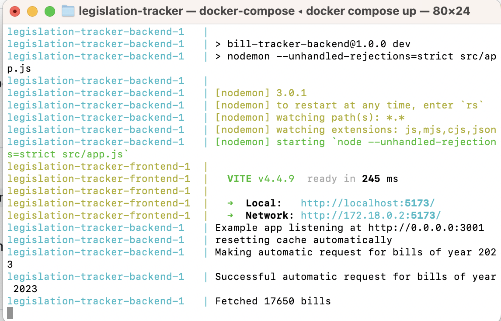
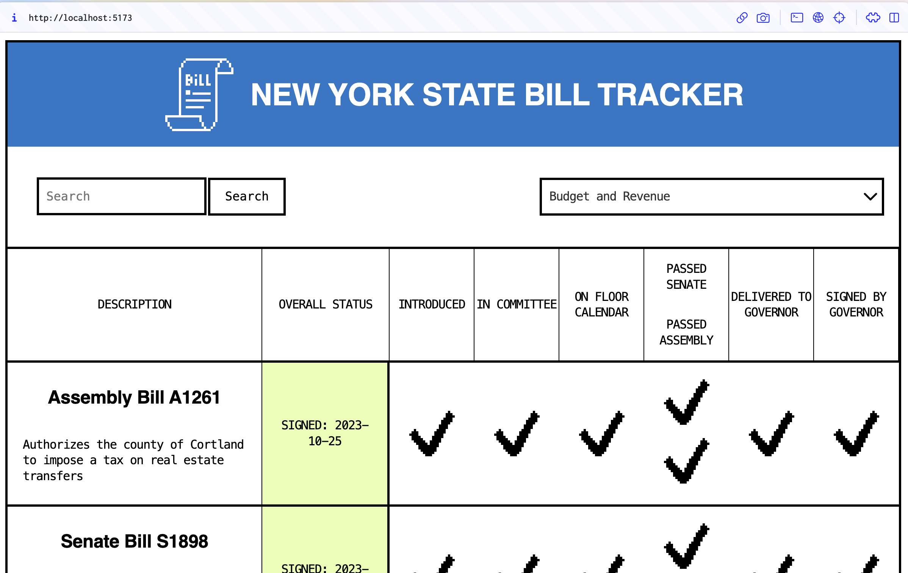

# Legislation Tracker

A tracker that shows the sponsors of a bill and the current status of a bill in the New York State Legislature (Assembly and Senate) and the New York City Council.

Compare to the [existing spreadsheet](https://docs.google.com/spreadsheets/d/1oTbQNLVf8iMC0ShOdkilr3Sh9d4-Rf8Gjt0ZyU2Gq18/edit#gid=1038006981).

## Prerequisites

- Install [Docker Desktop](https://www.docker.com/products/docker-desktop/)
- Get an API key from the [New York State API website](https://legislation.nysenate.gov/) if you don't already have one. 

## Local development

1. Clone this repo locally
1. Create a new file at the root of this project called `.env`
1. In the `.env` file, add the API key from the New York State website like so: `OPEN_LEGISLATION_KEY=asdlkfjaskldjflkasjdflkasjflkjadslfkj`
1. At the root of this project, in your Terminal or Powershell, run `docker-compose up`
1. If the build was successful, you will see something similar to the image below:

1. The localhost address next to the `legislation-tracker-frontend-1` shows where the front-end can be found.
1. Open this address on your browser to see the front-end of the application!

